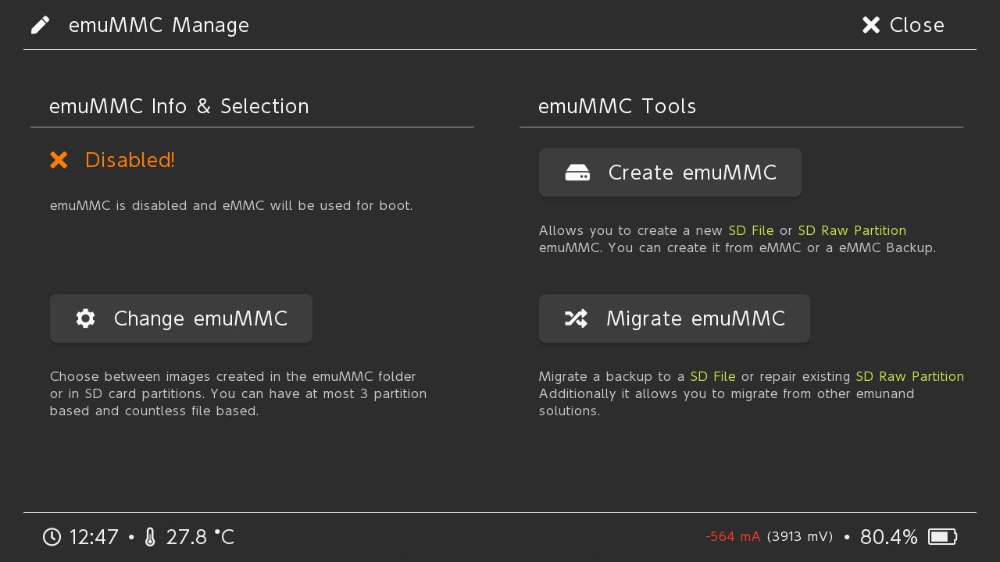

# Guide for Setting Up EmuMMC for Your Hacked Nintendo Switch with Linux

## Requirements

- Linux based operating system (Installed or LiveCD)
- GParted
- Root access

## Guide

1. Make sure everything on your SD Card is backed up on to your computer.
2. Open GParted.
3. Select your SD Card from the top left menu. **It is very important to select the correct device from this menu as this will be destructive.**

4. If any partitions have a mount point you will want to right click on them and click "Unmount".

5. Next go up to the Device menu and click "Create Partition Table..."

6. A dialog box should show up, make sure the partition table type is set to "msdos" and then click "Apply".

7. Right click on the unallocated space and click "New".

8. You will want to put in 29856 for "Free space following (MiB):", set the "File system:" to be "fat32", give it a label, and click "Add". This will be your SD Card partition that holds your atmosphere, bootloader, Nintendo, etc... folders.

9. Right click again on the unallocated space and click "New".

10. For this you want to set the "File system:" to be "fat32", and click "Add". This will be the partition for your emuMMC.

11. Click "Apply All Operations" up in the top bar, confirm you want to apply and wait for it to finish.

12. Next we want to zero out the beginning and end of our emuMMC partition. The reason for doing this is because we formatted the partition as fat32, however we really only needed GParted to set the partition ID to something Hekate would pick up. On top of this Hekate won't write to the first or last 512kb of the partition. This is problematic if it's formatted as fat32, as some operating systems will continue to see this partition as a fat32 partition, and try to repair it. To do this open up a console window and run the following commands making sure to replace the `-` with the drive letter of your SD Card and the `#` with the partition number of your emuMMC partition: (**It should go without saying, however this is highly destructive triple check you have the correct block device in the "of" argument.**)

        sudo dd if=/dev/zero of=/dev/sd-# bs=1M count=1 status=progress
        sudo dd if=/dev/zero of=/dev/sd-# seek=29854 bs=1M count=1 status=progress
    
13. To make sure you have done the last step correct go back to GParted, go to the GParted menu and click Refresh. Your emuMMC partition's file system should now be "unknown".

14. Next restore your files back to your SD Card. (Your SD Card will look different from mine.)

15. Eject your SD Card and insert it into your Switch. Turn your Switch on in RCM and inject the Hekate payload.
16. Tap on "emuMMC".

17. Tap on "Create emuMMC".

18. Tap on "SD Partition".

19. Tap on "Continue", and wait.

20. Tap on "Close" on the top right, and then tap on "Change emuMMC".

21. Tap on "SD RAW 1", and tap "OK".

22. Tap on "Close" on the top right, tap on "Launch", and boot into your emuMMC. (If you downloaded Hekate by itself then you needed to create a hekate_ipl.ini file in your bootloader folder. That is outside the scope of this guide. If you don't know how to do that then use Kosmos.)

23. Congratulations you are done. You can go into "System Settings", scroll down to "System", and you should see an "E" at the end of your "Current version:" indicating you are in your emuMMC.

## Disclaimer

I am not responsible for what happens to your data, your computer, or your Nintendo Switch. I have written this guide to be as easy to follow as possible, and have walked through the steps myself to make sure everything works to the best of my ability. If something happens because you fail to follow the guide then you have no one to blame, but yourself. If you find an issue with the guide feel free to leave an Issue or Pull Request, however I will not be troubleshooting, or supporting users in the use of this guide.