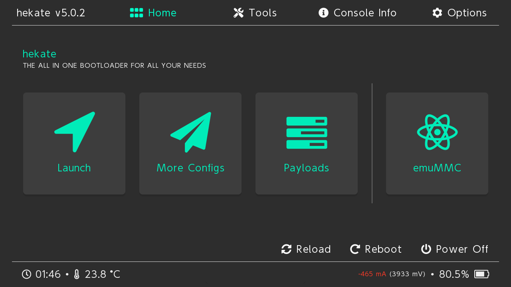
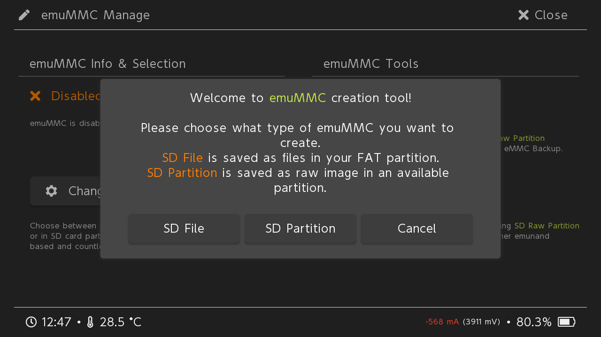
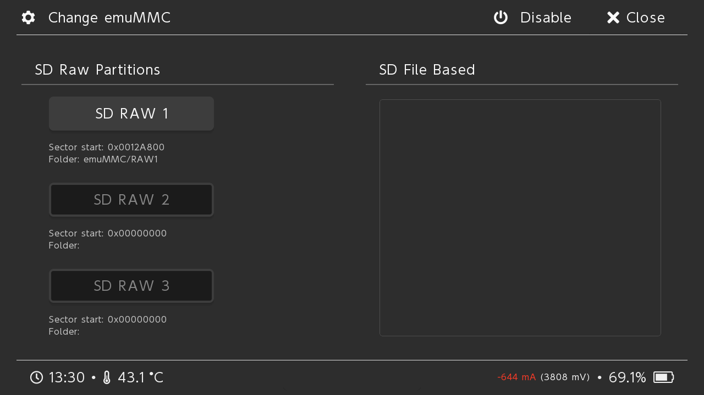
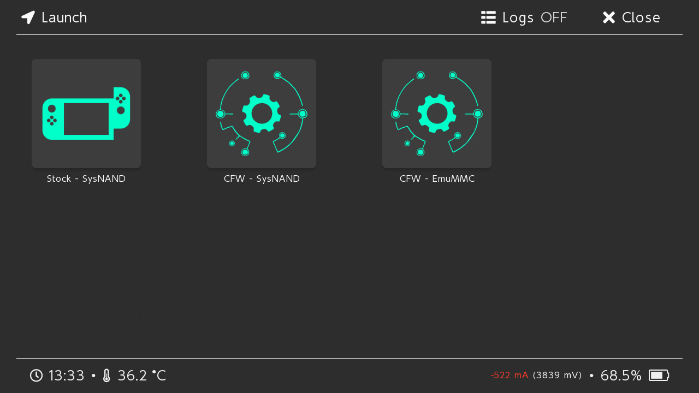
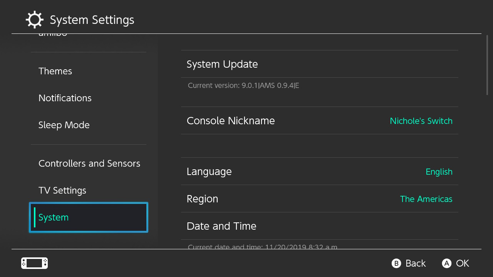

# Guide for Setting Up EmuMMC for Your Hacked Nintendo Switch with Mac OS

## Requirements

- Mac OS Catalina
- Administrator access

## Guide

1. Make sure everything on your SD Card is backed up on to your computer.
2. Open Terminal.
3. Run the follow command and identify which disk is your SD Card:
        
        diskutil list external

    

4. Run the following command, making sure to replace the `#` with the drive number, to get the size of the SD Card in bytes.

        diskutil info disk# | grep "Disk Size"

    

5. Take that number and subtract it by 31306285056 to get the size of our SD Card parition. (Ex. 31914983424 - 31306285056 = 608698368) With that number run the following command to partition your SD Card, making sure to replace `#` with the drive number and `PutSizeHere` with the number you came up with. (**This is highly destructive triple check you have the correct disk number as this will partition and format the disk.**)

        diskutil partitionDisk disk# MBR fat32 "SWITCH" PutSizeHere fat32 "EMUMMC" 31306285056

    

6. Run the following command to identify the partition number of your emuMMC partition, making sure to replace the `#` with the drive number.

        diskutil list disk#

    

7. Run the following command to unmount your EmuMMC partition, making sure to replace the first `#` with the drive number and the second `#` with the partition number of your emuMMC partition.

        diskutil unmount disk#s#

    

8. Next we want to zero out the beginning and end of our emuMMC partition. The reason for doing this is because we formatted the partition as fat32, however we only did this to set the partition ID to something Hekate would pick up. On top of this Hekate won't write to the first and last 512kb of the partition. This is problematic if it's formatted as fat32, as some operating systems will continue to see this partition as fat32, and will try to repair it. Run the following commands to zero out the first and last megabyte of the partition, making sure to replace the first `#` with the drive number of your SD Card and the second `#` with the partition number of your emuMMC partition. (**This is highly destructive triple check you have the correct block device in the "of" argument.**)

        sudo dd if=/dev/zero of=/dev/disk#s# bs=1m count=1
        sudo dd if=/dev/zero of=/dev/disk#s# seek=29853 bs=1m count=1

    

9. To make sure you have done the last step correctly eject your SD Card, disconnect and reconnect it to your computer. Mac OS should not mount your EmuMMC partition now.

10. Next restore your files back to your SD Card. (Your SD Card will look different from mine.)

    

11. Eject your SD Card and insert it into your Switch. Turn your Switch on in RCM and inject the Hekate payload.

12. Tap on "emuMMC".

    

13. Tap on "Create emuMMC".

    

14. Tap on "SD Partition".

    

15. Tap on "Continue", and wait.

    

16. Tap on "Close" on the top right, and then tap on "Change emuMMC".

    

17. Tap on "SD RAW 1", and tap "OK".

    

18. Tap on "Close" on the top right, tap on "Launch", and boot into your emuMMC. (If you downloaded Hekate by itself then you needed to create a hekate_ipl.ini file in your bootloader folder. That is outside the scope of this guide. If you don't know how to do that then use Kosmos.)

    

19. Congratulations you are done. You can go into "System Settings", scroll down to "System", and you should see an "E" at the end of your "Current version:" indicating you are in your emuMMC.

    

## Disclaimer

I am not responsible for what happens to your data, your computer, or your Nintendo Switch. I have written this guide to be as easy to follow as possible, and have walked through the steps myself to make sure everything works to the best of my ability. If something happens because you fail to follow the guide then you have no one to blame, but yourself. If you find an issue with the guide feel free to leave an Issue or Pull Request, however I will not be troubleshooting, or supporting users in the use of this guide.