# Guide for Setting Up EmuMMC for Your Hacked Nintendo Switch with Windows

## Requirements

- Windows 10
- [DiskGenius](https://www.diskgenius.com/)
- Administrator access

## Guide

1. Make sure everything on your SD Card is backed up on to your computer.
2. Open DiskGenius.
3. Click on your SD Card in the left menu. **It is very important to select the correct device from this menu as this will be destructive.**

    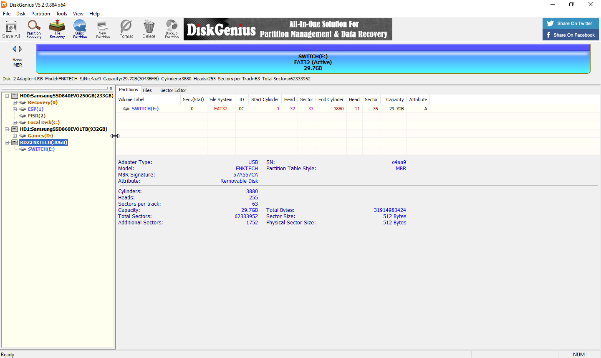

4. In the center right click on your partition and click on "Delete Current Partition(Del)".

    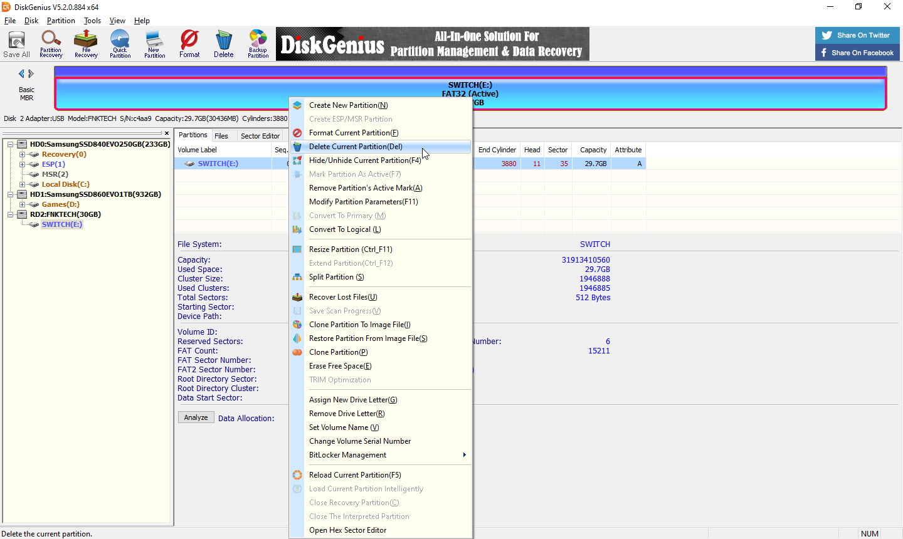

5. A dialog box should show up, click "Yes" to confirm.

    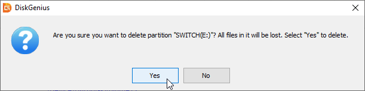

6. In the center right click in the empty space and click on "Create New Parition(N)".

    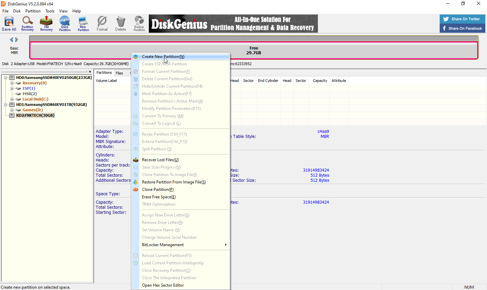

7. Make sure the partition type is set to "Primary Partition", and the file system type is "FAT32". To get the size of the partition you will want to take the total size available in MB and subtract it by 29856 MB to get the size of your first partition. (Ex 30436 - 29856 = 579) Give your partition a label, and then click "Ok". This will be your SD Card partition that holds your atmosphere, bootloader, Nintendo, etc... folders.

    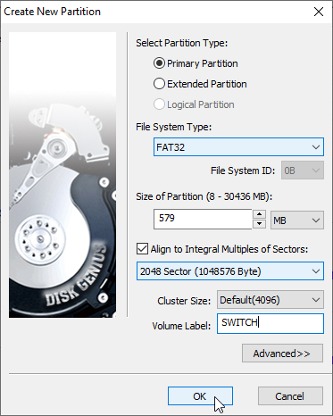

8. In the center right click in the empty space and click on "Create New Parition(N)" again.

    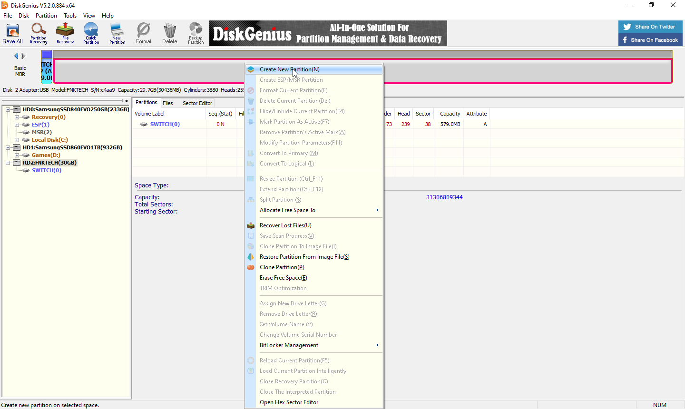

9. Make sure the partition type is set to "Primary Partition", and the file system type is "Linux swap". The default size should be 29856 MB, and you should not be able to give this parition a label, simply click "Ok" when everything looks good. This will be the partition for your emuMMC.

    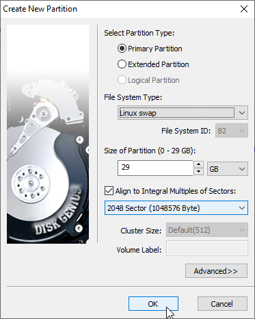

10. Click "Save All" up in the top left, confirm you want to write all changes and wait for it to finish.

    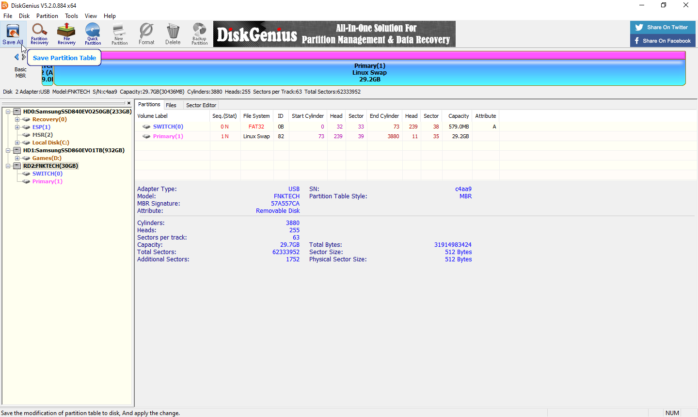

11. Once it finishes Windows will mount your SD Card, you may get a dialog prompt to format a drive. You will always want to hit "Cancel" on this. This is because Windows can not read your emuMMC partition.

    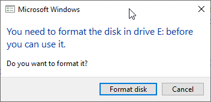

12. You can now close DiskGenius and restore your files back to your SD Card. (Your SD Card will look different from mine.)

    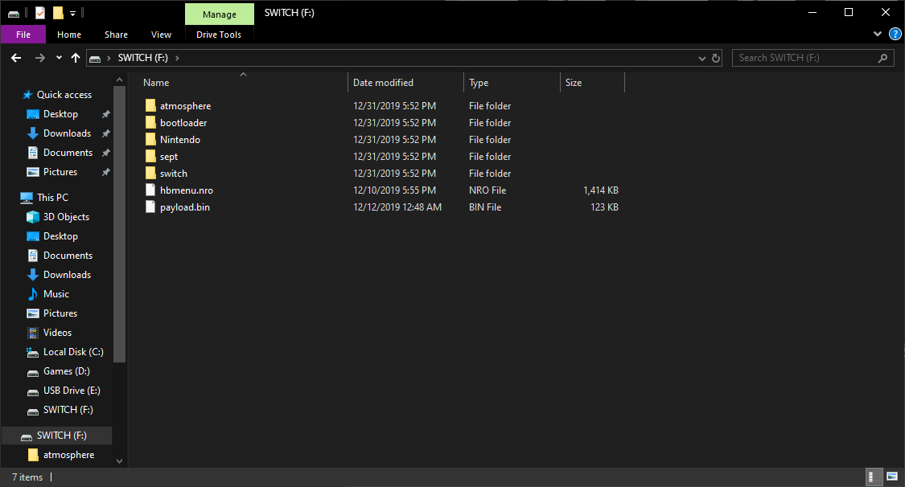

13. Eject your SD Card and insert it into your Switch. Turn your Switch on in RCM and inject the Hekate payload.
14. Tap on "emuMMC".

    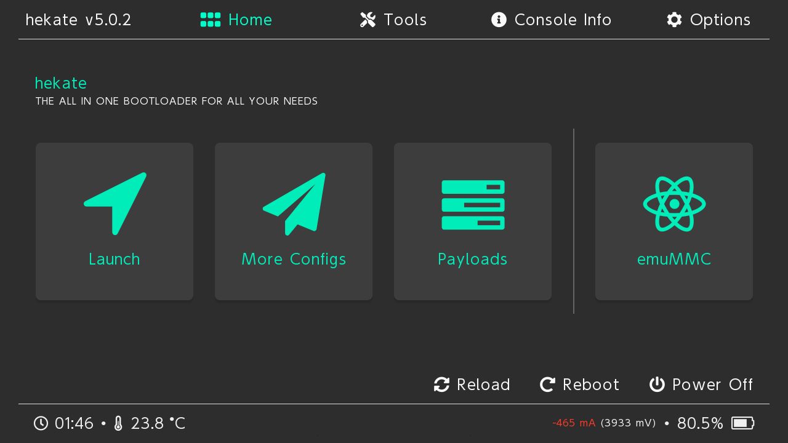

15. Tap on "Create emuMMC".

    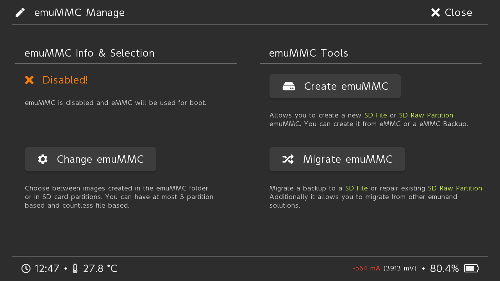

16. Tap on "SD Partition".

    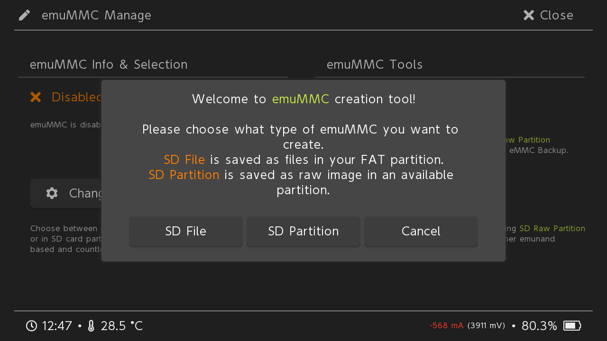

17. Tap on "Continue", and wait.

    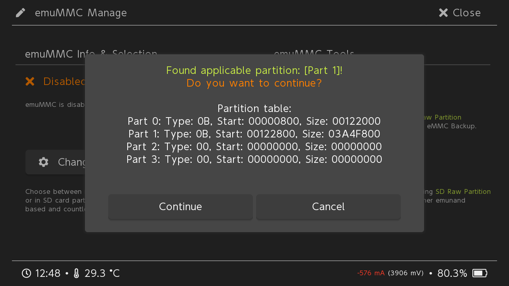

18. Tap on "Close" on the top right, and then tap on "Change emuMMC".

    

19. Tap on "SD RAW 1", and tap "OK".

    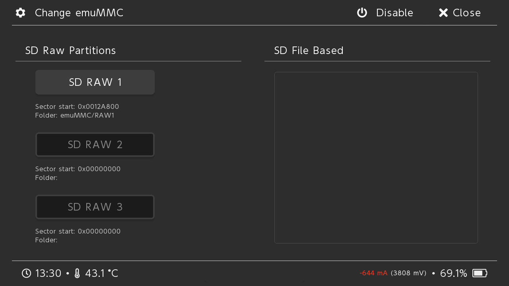

20. Tap on "Close" on the top right, tap on "Launch", and boot into your emuMMC. (If you downloaded Hekate by itself then you needed to create a hekate_ipl.ini file in your bootloader folder. That is outside the scope of this guide. If you don't know how to do that then use Kosmos.)

    

21. Congratulations you are done. You can go into "System Settings", scroll down to "System", and you should see an "E" at the end of your "Current version:" indicating you are in your emuMMC.

    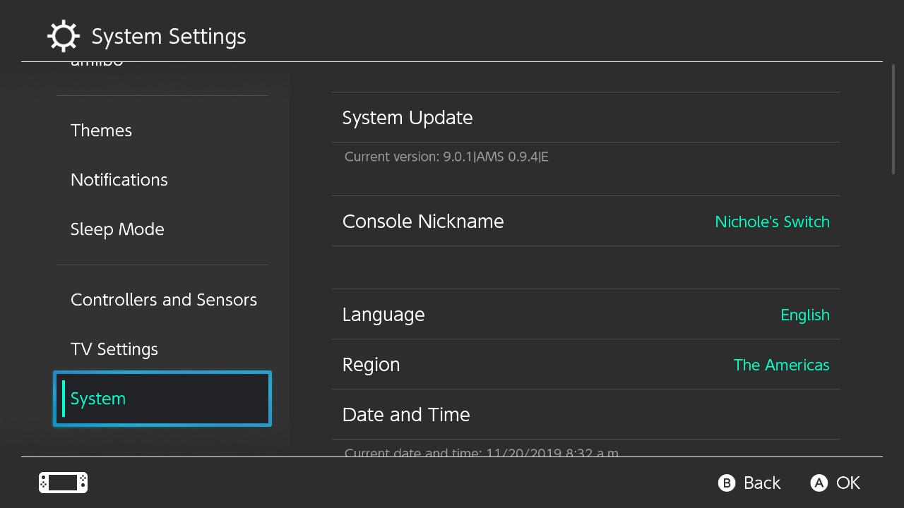

## Disclaimer

I am not responsible for what happens to your data, your computer, or your Nintendo Switch. I have written this guide to be as easy to follow as possible, and have walked through the steps myself to make sure everything works to the best of my ability. If something happens because you fail to follow the guide then you have no one to blame, but yourself. If you find an issue with the guide feel free to leave an Issue or Pull Request, however I will not be troubleshooting, or supporting users in the use of this guide.